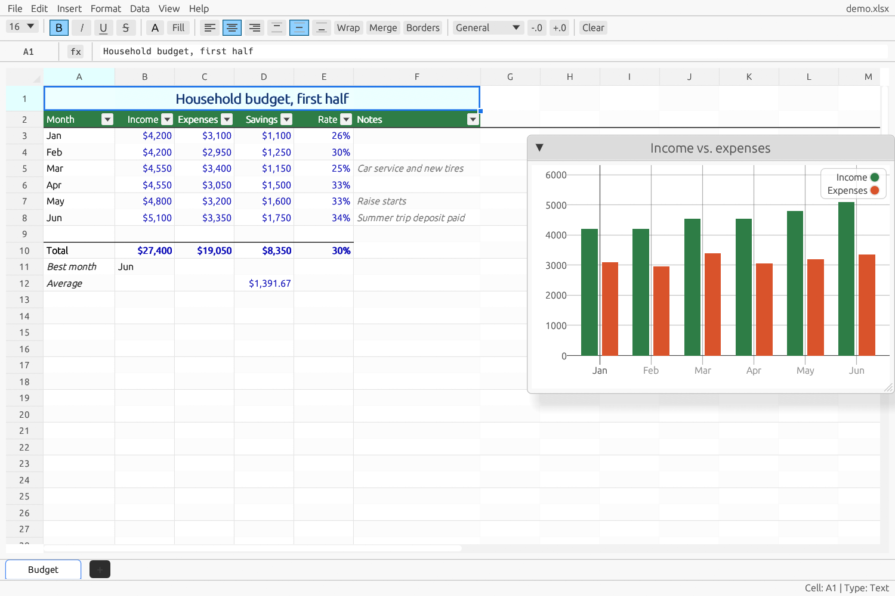

<p align="center">
  
</p>

<h1 align="center">RustSheet</h1>

<p align="center">
  A fast, native spreadsheet with an Excel-compatible formula engine.<br>
  Opens and saves <code>.xlsx</code> and <code>.csv</code>. No account, no cloud, no telemetry.
</p>

<p align="center">
  <a href="https://github.com/Divhanthelion/rustsheet/actions/workflows/ci.yml"></a>
  <a href="LICENSE"></a>
</p>



## Features

- **100+ Excel functions** across math, statistics, text, logic, lookup and dates: `SUM`, `AVERAGE`, `IF`, `VLOOKUP`, `INDEX`/`MATCH`, `SUMIF`/`COUNTIF` with wildcards, `TEXT`, `ROUND`, and more. Press **F1** for the full list with examples.
- **Live recalculation** with dependency tracking and cycle detection (`#CIRC!`).
- **Multiple sheets** with cross-sheet references (`Sheet2!A1`, `SUM(Sheet2!A1:A10)`). Renaming a sheet rewrites the formulas that use it.
- **Formatting**: bold, italic, underline, strikethrough, font size and color, fills, borders, alignment, and Excel number formats (currency, percent, dates, times, fractions, custom codes like `#,##0.00_);[Red](#,##0.00)`). Resize columns and rows by dragging, or double-click a column border to fit it.
- **Smart entry**: typing `12%`, `$1,234.50`, `2026-10-03` or `2:30 PM` stores a number and picks the matching format.
- **Charts**: line, bar, scatter, area, pie and doughnut, saved into the workbook.
- **Excel files**: read and write values, formulas, formatting, column widths, row heights and charts in `.xlsx`.
- **CSV**: import and export, formulas included.
- **Copy and paste** within RustSheet (formulas follow their new position, formats come along) and with Excel, Google Sheets or any app that copies tab-separated text. Cut and paste moves cells.
- **Full-size sheets**: Excel's 1,048,576 rows by 16,384 columns, with scrollbars and Excel-style navigation (Ctrl+Arrow, Ctrl+End, Ctrl+A).
- **Rows and columns**: insert, delete, hide, resize and freeze. Formulas, formats, merges, charts and filters follow; references to deleted cells become `#REF!`. Click or drag headers to select whole rows or columns, and format them in one go.
- **Sort and filter**: sort by one column or several, and AutoFilter with value lists and search.
- **Find and Replace** with `*` and `?` wildcards, in formulas or shown values, on one sheet or all of them.
- **Fill**: Ctrl+D and Ctrl+R, or drag the fill handle to continue a series (numbers, dates, "Item 1", months, weekdays).
- **Merged cells and wrapped text**, vertical alignment, and long text that spills into empty neighbors.
- **Print and PDF**: print through the Windows print dialog, or export a PDF, with gridlines, fit to width, or the selection only.
- **Crash safe**: unsaved work is autosaved every minute and offered back if RustSheet ever closes unexpectedly; saves replace files atomically.
- **Undo/redo**, formula autocomplete, light and dark themes (or follow Windows), recent files, and screen reader support.

### Excel compatibility notes

- Aggregates (`AVERAGE`, `COUNT`, `PRODUCT`, `MIN`, `MAX`, `SUMIF`, `COUNTIF`) skip blanks and text, as Excel does.
- `MOD`, `CEILING` and `FLOOR` follow Excel's sign rules.
- Numbers display in Excel's General format: as many decimals as fit the column, then scientific notation.
- `TEXT` uses the same formatter as cells, so it accepts the same format codes.

## File formats

| Format | Open | Save |
|--------|------|------|
| `.xlsx` | Workbook, formulas, formatting, charts | Workbook, formulas, formatting, charts |
| `.csv` | One sheet | Current sheet only |

`.xls` and `.ods` are not supported. From `.xlsx`, RustSheet keeps fonts (bold, italic, underline, strikethrough, size, color), solid fills, borders (drawn as thin lines), alignment, wrapped text, number formats, row and column formats, column widths, row heights, hidden rows and columns, merged cells, frozen panes and AutoFilters. It does not keep font names, conditional formatting, data validation, comments, images or pivot tables.

## Install

**Windows**: the Microsoft Store listing is coming soon. Until then, build from source.

## Build from source

Requires Rust 1.87 or newer.

```bash
cargo run --release          # the app
cargo test                   # engine, file I/O and GUI unit tests
cargo run --release -- file.xlsx   # open a file at startup
```

Default features are `gui`, `xlsx` and `csv`. For the engine alone (no GUI):

```bash
cargo test --no-default-features --features xlsx,csv
```

### Windows package (MSIX)

Needs the Windows 10/11 SDK. See [packaging/windows/STORE.md](packaging/windows/STORE.md) for the Store submission steps.

```powershell
.\packaging\windows\build-msix.ps1                  # x64
.\packaging\windows\build-msix.ps1 -Arch x64,arm64  # both, plus a .msixbundle
```

## Keyboard shortcuts

| Keys | Action |
|------|--------|
| Ctrl+N / Ctrl+O / Ctrl+S / Ctrl+P | New / Open / Save / Print |
| Ctrl+Z / Ctrl+Y | Undo / Redo |
| Ctrl+C / Ctrl+X / Ctrl+V | Copy / Cut / Paste |
| Ctrl+F / Ctrl+H | Find / Replace |
| Ctrl+D / Ctrl+R | Fill down / right |
| Delete | Clear the selected cells |
| Ctrl+B / Ctrl+I / Ctrl+U | Bold / Italic / Underline |
| F2 or type | Edit the active cell |
| Enter / Tab | Move down / right (Shift goes back) |
| Ctrl+Arrow, Ctrl+End | Jump to the edge of the data, the last used cell |
| Shift+Arrow | Extend the selection |
| Ctrl+A, Ctrl+Space, Shift+Space | Select the data, a column, a row |
| Ctrl+Shift+= / Ctrl+- | Insert / delete rows or columns |
| Ctrl+Shift+L | Filter on or off |
| F4 | Toggle absolute/relative reference |
| F1 | Help and function reference |

## Architecture

| Module | Role |
|--------|------|
| `cell/` | Coordinates, values, string interning |
| `grid/` | Sparse sheet storage |
| `format/` | Cell formats, number format codes, typed-input parsing |
| `formula/` | pest grammar and Pratt parser |
| `calc/` | `CalcEngine`, function library, dependency graph |
| `chart/` | Chart definitions, rendering, LTTB downsampling |
| `xlsx/`, `csv_io/` | File I/O |
| `gui/` | egui application |

## Privacy

RustSheet collects no data and makes no network connections. See [PRIVACY.md](PRIVACY.md).

## License

[MIT](LICENSE)
